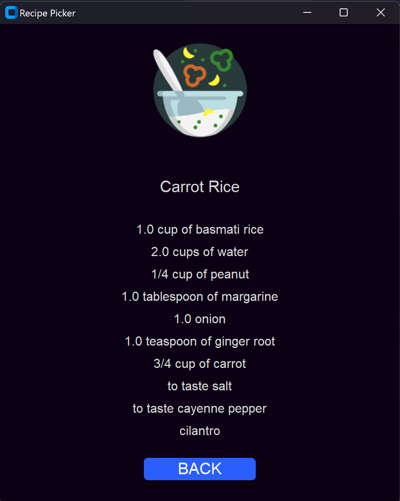
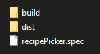

# RECIPE CREATOR - Random recipes with just one click

# **INDEX**

- [Project Description](#project-description)
  - [Download and Installation](#download-and-installation)
  - [Technologies Used](#technologies-used)
- [Contributions](#contributions)

Recipe creator is my very first application created on Python, you can see the repository of this project here:

***https://github.com/Xyehtz/Recipe-Picker***

## Project Description

Recipe Picker is an app created on Python and based on a tutorial from YouTube, from the channel "Python Simplified" (YouTube Channel: ***https://www.youtube.com/@PythonSimplified***) this simple app gives the user random recipes with just one click, giving the user full and detailed information about the recipe, mainly the ingredients of it, here is an example image of the app:

### Download and Installation

To download and install the Recipe Picker app follow these instructions:

- Go to: ***https://drive.google.com/drive/folders/10LhDq1kLvHvXgKVPc6B7k7k2y-bxNLVG?usp=sharing***.
- Download the zip file inside the folder.
- After downloading decompress the zip file.
- You'll find a folder called `RecipePicker` and inside of it three files, two of them folders:

    

- To insatall Recipe Picker go to dist/recipePicker/recipePicker.exe.
- Follow the instructions on the wizard and recipePicker should be ready for you to use.

### Technologies Used

This project uses the following technologies and packages, you can find a file with all the packages used in this project on the main branch.

`Customtkinter`: This is the main package used on this project and is in charge of everything related to the GUI, in this project I use `Customtkinter` because of it's similarity with the normal `Tkinter`, and also because of it's modern interfrace which makes the GUI feel more advanced and clean in comparision with the normal `Tkinter`.

`PIL`: `PIL` or `Python Imaging Library` is the package that I used in this project to be able to load all the images used on the application.

`SQLite3`: This database is used to store all the information of the recipes such as recipes names, ingredients, quantity and unit, while keeping it organized so that it can be easily modified.

`Numpy`: Used for randomly selecting the recipes.

`sys` and `os`: To obtain all the resources used, this could be images, fonts and the database.

`Pyglet`: To easily add and load custom fonts on the app.

`Pyinstaller`: To create the .exe file of the app and used it on different devices.

## Contributions

You are free to contribute to this project, for this reason I leave below the contribution process and a series of guidelines for the contributors:

### Contribution Process

Here is a list of the things that you should do to contribute to this project:

- Fork this repository and clone it to your local machine.
- Create a new branch for you contribution using: git checkout -b "the name of your contribution".
- Make the necessary changes and improvements on your local branch.
- Make sure to follow a style guideline and maintain a code consistency.
- Commit your changes using: git commit -m "commit description".
- Open a pull request so I can review your changes.

### Contribution Guidelines

- Please maintain a respectful and friendly tone in all interactions related to this project.
- If you're reporting a bug, provide detailed information on how to reproduce it.
- If you're proposing a new feature, explain its usefulness and provide code examples if possible.
- Whenever possible, include unit tests or integration tests to support your changes.
- I appreciate your time and contributions to make this project better. I look forward to your participation!

## LICENSE

This project is created under the MIT License. Consult the LICENSE file for more details.

## Gratitudes

I want to show my gratitude to Python Simplified fo the sereies of videos made of the topic, videos that helped me to be able to recreate the same app, but adding some new tweaks that made the project a little bit better, I leave all the information related to Python Simplified.

- Python Simplified YouTube Channel: ***https://www.youtube.com/@PythonSimplified***.
- Python Simplified GitHub Profile: ***https://github.com/MariyaSha***.
- Python Simplified Discord Server: ***https://discord.com/invite/wgTTmsWmXA***.
